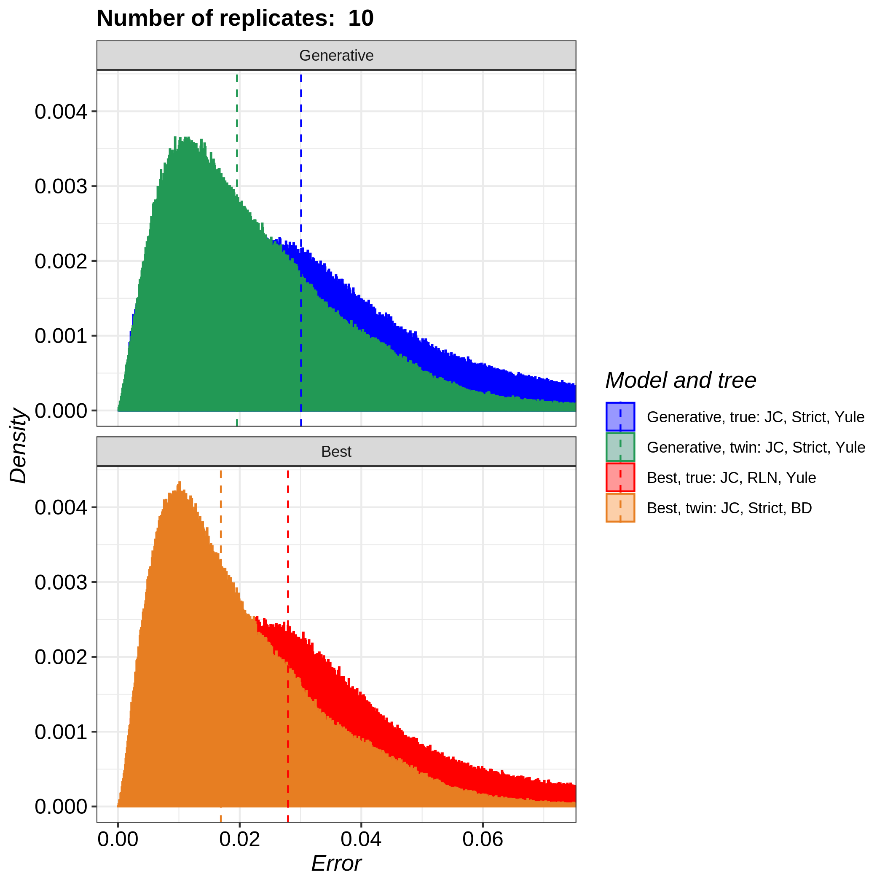

# pirouette_example_43

Branch   |[](https://travis-ci.com)                                                                                                 |[](https://appveyor.com)                                                                                               
---------|--------------------------------------------------------------------------------------------------------------------------------------------------------------|-------------------------------------------------------------------------------------------------------------
`master` |[](https://travis-ci.com/richelbilderbeek/pirouette_example_43) |.
`develop`|[](https://travis-ci.com/richelbilderbeek/pirouette_example_43)|.

A [pirouette example](https://github.com/richelbilderbeek/pirouette_examples)
that shows the pirouette plot for multiple DD trees.

This figure is to be used for the pirouette article.

## Running on Peregrine

Install `pirouette` using the [peregrine](https://github.com/richelbilderbeek/peregrine)
bash and R scripts.

Then, in the main folder of this repo, type:

```
sbatch scripts/rerun.sh
```

## Related settings

 * [One exemplary DD tree (instead of 10)](https://github.com/richelbilderbeek/pirouette_example_30)
 * [Ten replicates on artifical tree (instead of DD)](https://github.com/richelbilderbeek/pirouette_example_31)
 * [DNA alignent of 500 nucleotides (instead of 1k)](https://github.com/richelbilderbeek/pirouette_example_19)
 * [Use 12 taxa (instead of 6)](https://github.com/richelbilderbeek/pirouette_example_32)
 * [Use 24 taxa (instead of 6)](https://github.com/richelbilderbeek/pirouette_example_33)

## Results

 * Download the intermediate data at 
   [https://www.richelbilderbeek.nl/pirouette_example_43.zip](https://www.richelbilderbeek.nl/pirouette_example_43.zip)



